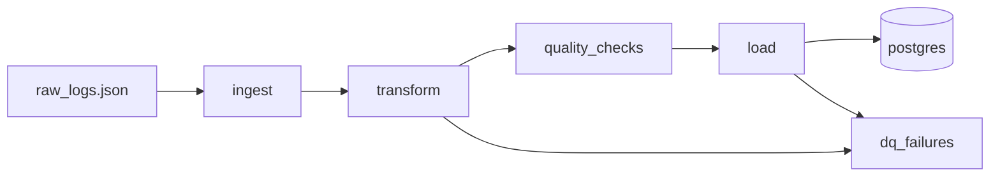
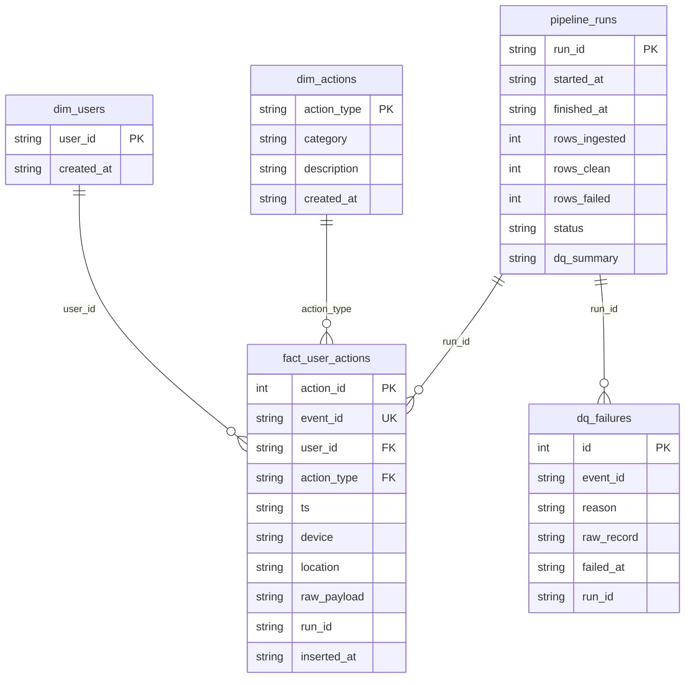

# Healthcare ETL Pipeline

Ingests raw mobile app JSON logs, transforms and validates them in Python, models them into a
star schema, and loads them into PostgreSQL.

## Pipeline



The orchestration layer is a Prefect 3 flow with task-level retries.

## Requirement Coverage

| Requirement                                   | Implementation                              |
| --------------------------------------------- | ------------------------------------------- |
| Ingest `raw_logs.json`                        | `src/ingest.py`                             |
| Clean and transform in Python                 | `src/transform.py`                          |
| Normalize timestamps to UTC ISO               | `src/models.py` (`_parse_to_utc()`)         |
| Drop rows missing `user_id` / `action_type`   | `src/transform.py`, logged to `dq_failures` |
| Extract `device` and `location`               | flattened from `metadata` onto fact table   |
| Star schema with fact + 2 dims                | `sql/schema_postgres.sql`                   |
| Load into PostgreSQL                          | `src/load.py` via Docker Compose            |
| Data quality checks                           | `src/quality_checks.py`                     |
| Orchestration (Prefect)                       | `flows/etl_flow.py`                         |
| Dockerized                                    | `Dockerfile` + `docker-compose.yml`         |

## Data Model



`device` and `location` are event-level attributes - they live on the fact table, not on `dim_users`.

`event_id` is a deterministic SHA-256 hash of `(user_id, normalized_utc_timestamp, action_type)`.
Re-ingesting the same file produces identical hashes, so all loads are idempotent.

## Data Quality Rules

| Rule                                  | Stage          | Action                              |
| ------------------------------------- | -------------- | ----------------------------------- |
| Row parses as expected schema         | Ingest         | invalid rows audited as `DQFailure` |
| `user_id` present                     | Transform      | rejected and logged                 |
| `action_type` present                 | Transform      | rejected and logged                 |
| Timestamp parseable as ISO-8601       | Transform      | rejected and logged                 |
| No duplicate events in the batch      | Transform      | later duplicate rejected and logged |
| No null `user_id` in clean data       | Quality checks | reported in `dq_summary`           |
| No null `action_type` in clean data   | Quality checks | reported in `dq_summary`           |
| No duplicate `event_id` in clean data | Quality checks | reported in `dq_summary`           |
| All timestamps timezone-aware         | Quality checks | reported in `dq_summary`           |
| All action types in known catalog     | Quality checks | reported in `dq_summary`           |
| All devices in known catalog          | Quality checks | reported in `dq_summary`           |

A completely invalid JSON file raises `json.JSONDecodeError`. Row-level issues inside a valid
array are captured as `DQFailure` rows and never silently dropped.

## Run with Docker and PostgreSQL

```bash
docker compose up --build
```

Starts PostgreSQL, applies `sql/schema_postgres.sql`, and runs the Prefect flow against
`data/raw_logs.json`.

## Development

```bash
pip install -r requirements-dev.txt
PYTHONPATH=. pytest tests/ -v --tb=short
ruff check .
ruff format --check .
```

`make` targets are also available: `run`, `test`, `lint`, `format`.

## Design Decisions

**Prefect over Airflow** - Prefect 3 runs without a separate server process, which keeps the
Docker Compose stack to two containers. Airflow would add a scheduler, webserver, and database,
which is overhead not justified at this data volume.

**Deterministic `event_id`** - the source data has no natural unique key per event. A SHA-256
hash of `(user_id, normalized_utc_timestamp, action_type)` makes every load idempotent: re-running against the
same file inserts 0 duplicate rows rather than requiring a pre-truncate step.

**DQ failures are informational, not blocking** - the transform stage rejects invalid records
early and logs them to `dq_failures`. The quality-check stage runs assertions on the clean
batch but does not halt the pipeline on failure. This separates data validation from pipeline
control flow and gives operators full visibility without causing unnecessary outages.

**`device` and `location` on the fact table** - both fields vary per event, not per user or
action type. Putting them on a separate dimension would create a high-cardinality dimension with
no reuse benefit.

**What would change with more time** - streaming ingestion (chunked reads for large files),
a source abstraction layer to support CSV or API inputs alongside JSON, and integration tests
against a real PostgreSQL instance for the load stage.

## Example Result

The checked-in `data/raw_logs.json` is the sample input used for the example run shown below.
Running the sample dataset produces:

```
fact_user_actions : 100 rows
dim_users         :  10 rows
dim_actions       :   5 rows
dq_failures       :   0 rows
pipeline_runs     :   1 successful run recorded
```